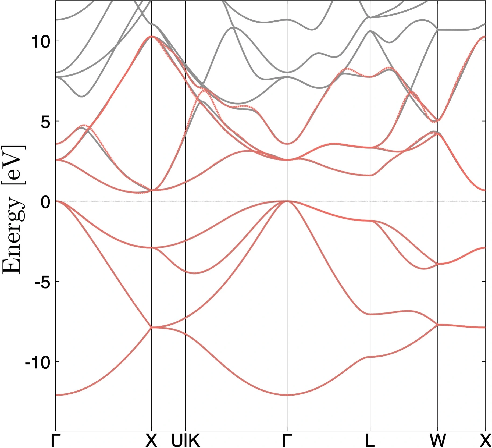

# 36: Silicon &#151; Closest Wannier functions

- Outline: Compute the closest Wannier functions (CWFs) and
    the Wannier interpolated band structure of
    bulk crystalline silicon based on the closest Wannier method
    using hydrogenic atomic $s$ and $p$ orbitals.
    For more details on the closest Wannier method, see Ref.[@ozaki-prb24].

- Directory: `tutorials/tutorial36/` *Files can be downloaded from
    [here](https://github.com/wannier-developers/wannier90/tree/develop/tutorials/tutorial36)*

- Input files

    - `silicon.scf` *The `pw.x` input file for ground state calculation*

    - `silicon.bands` *The `pw.x` input file for band structure calculation*

    - `silicon.bandsx` *The `bands.x` input file for extracting band structure eigenvalues*

    - `silicon.nscf` *The `pw.x` input file to obtain Bloch states on a uniform grid*

    - `silicon.pw2wan` *The input file for `pw2wannier90.x`*

    - `silicon.win` *The input file for `wannier90.x`*

    - `plot_band.gnu` *The gnuplot script to compare DFT and Wannier bands*

&nbsp;

1. Run `pw.x` to obtain the ground state of silicon

    ```bash title="Terminal"
    pw.x < silicon.scf > scf.out
    ```

2. Run `pw.x` to obtain the band structure of silicon

    ```bash title="Terminal"
    pw.x < silicon.bands > bands.out
    ```

3. Run `bands.x` to obtain a `silicon.band.gnu` file containing the band
    structure of silicon

    ```bash title="Terminal"
    bands.x < silicon.bandsx > bandsx.out
    ```

4. Run `pw.x` to obtain the Bloch states on a uniform k-point grid

    ```bash title="Terminal"
    pw.x < silicon.nscf > nscf.out
    ```

5. Run `wannier90.x` to generate a list of the required overlaps (written into the
    `silicon.nnkp` file).

    ```bash title="Terminal"
    wannier90.x -pp silicon
    ```

6. Run `pw2wannier90.x` to compute the overlap between Bloch states and
    the projections for the starting guess (written in the `silicon.mmn`
    and `silicon.amn` files).

    ```bash title="Terminal"
    pw2wannier90.x < silicon.pw2wan > pw2wan.out
    ```

7. Run `wannier90.x` to compute the CWFs.

    ```bash title="Terminal"
    wannier90.x silicon
    ```

    The closest Wannier method can be used by specifying in `silicon.win`

    ```vi title="Input file"
    use_cwf_method = .true.
    ```

    Following the closeset Wannier method, the overlap between Bloch states and
    the projections is multiplied by the window function $w(\varepsilon)$
    (See Eq. (4) in Ref. [@ozaki-prb24]):
    $$
    \begin{align}
    & A_{mn}^{(\bf{k})} = w(\varepsilon_{m\bf{k}}) \langle \psi_{m{\bf k}}|g_{n}\rangle,
    \\
    & w(\varepsilon)
    = \frac{1}{e^{(\varepsilon - \mu_{\rm max})/\sigma_{\rm max}} + 1}
    - \frac{1}{e^{(\mu_{\rm min} - \varepsilon)/\sigma_{\rm min}} + 1}
    - 1 + \delta,
    \end{align}
    $$
    where $\mu_{\rm min}$ and $\mu_{\rm max}$ ($\mu_{\rm min} < \mu_{\rm max}$)
    represent the bottom and top of the energy window, and
    $\sigma_{\rm min}$ and $\sigma_{\rm max}$ are introduced to control
    the degree of smearing around $\mu_{\rm min}$ and $\mu_{\rm max}$.

    $\mu_{\rm max}$, $\mu_{\rm min}$, $\sigma_{\rm max}$, $\sigma_{\rm min}$, and
    $\delta$ can be specified in `silicon.win`

    ```vi title="Input file"
    cwf_mu_max    = 10
    cwf_mu_min    = -15
    cwf_sigma_max = 2.0
    cwf_sigma_min = 0.0
    cwf_delta     = 1e-12
    ```

    As a result of the smearing given by Eq. (2),
    all Bloch states are incorporated into
    the projection with specific weights, where the weight is
    particularly large inside the window
    ($\mu_{\rm min} < \varepsilon_{m\bf{k}} < \mu_{\rm max}$),
    whereas it is small outside of the window.
    $\delta$ is a small constant introduced to prevent the matrix
    consisting of $A_{mn}^{(\bf{k})}$ from becoming ill-conditioned.

    The unitary matrix is obtained by
    $\mathbf{U}^{(\mathbf{k})} = \mathbf{A}^{(\bf{k})}
    (\mathbf{A}^{(\bf{k}) \dagger} \mathbf{A}^{(\bf{k})})^{-1/2}$
    without iterative calculations for disentanglment of bands
    and wannierisation

    ```vi title="Input file"
    dis_num_iter = 0
    num_iter     = 0
    ```

    Note that the disentanglement of bands is naturally
    taken into account by introducing a window function.
    By properly choosing $\mu_{\rm min}$, $\mu_{\rm max}$,
    $\sigma_{\rm min}$, $\sigma_{\rm max}$, and $\delta$,
    one can obtain the Wannier functions *closest* to the initial guesses in
    a Hilbert space (see Eqs. (5)~(17) in Ref. [@ozaki-prb24]).

    Inspect the output file `silicon.wout`.
    The CWFs are obtained without any iterative calculations,
    significantly reducing the computational costs.
    On the other hand, the spreads of the CWFs are larger than the MLWFs.

8. Run `gnuplot` to compare DFT and Wannier-interpolated bands,
   this will generate a PDF file `silicon_band.pdf`, see
   Fig.[Bands comparison](#fig:silicon_band).

    ```bash title="Terminal"
    ./plot_bands.gnu
    ```

    <figure markdown="span" id="fig:silicon_band">
    {width="500"}
    <figcaption> Comparison of band dispersions obtained from
    DFT calculations (grey solid lines) and Wannier interpolation using
    closest Wannier method (red dashed lines).
    </figcaption>
    </figure>

9. (Optional) Clean up all output files

    ```bash title="Terminal"
    make clean
    ```

## Further ideas

- To plot the CWFs, uncomment the following lines in
    `silicon.pw2wan`

    ```vi title="Input file"
    !write_unk = .true.
    ```

    and `silicon.win`

    ```vi title="Input file"
    !wannier_plot = .true.
    !wannier_plot_supercell = 3
    ```

- Recompute the CWFs using $sp3$ projection orbitals by changing
  the following lines in `silicon.win`

    ```vi title="Input file"
    Begin Atoms_Frac
    Si1           0.0000000000        0.0000000000        0.0000000000
    Si2          -0.2500000000        0.7500000000       -0.2500000000
    End Atoms_Frac
    ```

    ```vi title="Input file"
    Begin Projections
    Si1:sp3:z=0,0,-1:x=0,1,0
    Si2:sp3
    End Projections
    ```

    or

    ```vi title="Input file"
    Begin Projections
    Si1:sp3
    Si2:sp3:z=0,0,-1:x=0,1,0
    End Projections
    ```

- Recompute the CWFs with different free parameters and
  note how the spreads and accuracy of the interpolation change.
  The procedure for automatically determining the free parameters
  by using pseudo-atomic orbitals in pseudopotential is demonstrated
  in `tutorials/tutorial37/`.
