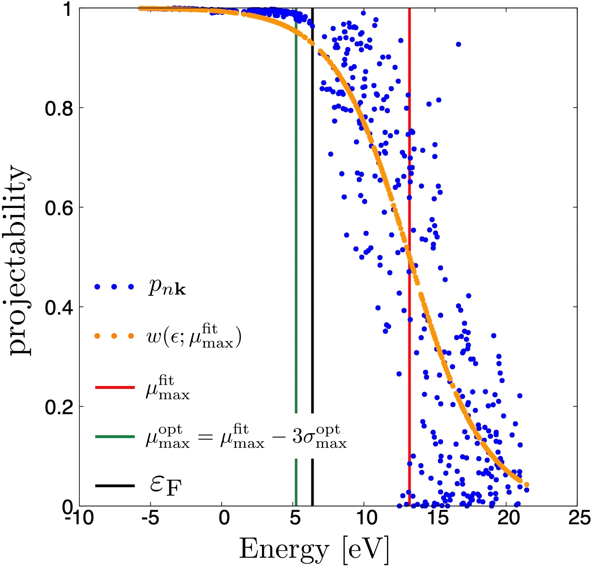
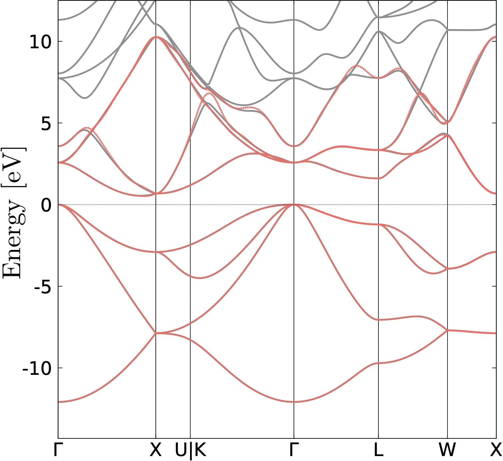

# 37: Silicon &#151; CWFs parameters from projectability

- Outline: Compute the closest Wannier functions (CWFs) and
    the Wannier interpolated band structure of
    bulk crystalline silicon based on the closest Wannier method
    using pseudo-atomic orbitals (PAOs).
    Similar to the SCDM method (see Tutorial [27](tutorial_27.md)
    and Tutorial [32](tutorial_32.md) for more details),
    the free parameters in the closest Wannier method, i.e.,
    $\mu_{\rm min}$, $\mu_{\rm max}$, $\sigma_{\rm min}$, $\sigma_{\rm max}$
    are obtained by fitting a window function to the projectabilities (See Ref. [@Vitale2019automated]).
    The number of CWFs is given by the number of PAOs in the
    pseudopotential, $8$ in this case.

- Directory: `tutorials/tutorial37/` *Files can be downloaded from
    [here](https://github.com/wannier-developers/wannier90/tree/develop/tutorials/tutorial37)*

- Input files

    - `silicon.scf` *The `pw.x` input file for ground state calculation*

    - `silicon.bands` *The `pw.x` input file for band structure calculation*

    - `silicon.bandsx` *The `bands.x` input file for extracting band structure eigenvalues*

    - `silicon.nscf` *The `pw.x` input file to obtain Bloch states on a uniform grid*

    - `silicon.pw2wan` *The input file for `pw2wannier90.x`*

    - `silicon.win` *The input file for `wannier90.x`*

    - `plot_band.gnu` *The gnuplot script to compare DFT and Wannier bands*

&nbsp;

1. Run `pw.x` to obtain the ground state of silicon

    ```bash title="Terminal"
    pw.x < silicon.scf > scf.out
    ```

2. Run `pw.x` to obtain the band structure of silicon

    ```bash title="Terminal"
    pw.x < silicon.bands > bands.out
    ```

3. Run `bands.x` to obtain a `silicon.band.gnu` file containing the band
    structure of silicon

    ```bash title="Terminal"
    bands.x < silicon.bandsx > bandsx.out
    ```

4. Run `pw.x` to obtain the Bloch states on a uniform k-point grid

    ```bash title="Terminal"
    pw.x < silicon.nscf > nscf.out
    ```

5. Run `wannier90.x` to generate a list of the required overlaps (written into the
    `silicon.nnkp` file).

    ```bash title="Terminal"
    wannier90.x -pp silicon
    ```

6. Run `pw2wannier90.x` to compute the overlap between Bloch states and
    the projections for the starting guess (written in the `silicon.mmn`
    and `silicon.amn` files).

    ```bash title="Terminal"
    pw2wannier90.x < silicon.pw2wan > pw2wan.out
    ```

7. Fit the projectabilities with the window function
    $$
    \begin{align}
    & w(\varepsilon;\mu_{\rm max}, \mu_{\rm min}, \sigma_{\rm max}, \sigma_{\rm min})
    = \frac{1}{e^{(\varepsilon - \mu_{\rm max})/\sigma_{\rm max}} + 1}
    - \frac{1}{e^{(\mu_{\rm min} - \varepsilon)/\sigma_{\rm min}} + 1}
    - 1 + \delta, \qquad (\delta = 10^{-12}).
    \end{align}
    $$
    The projectability of each Bloch state $\psi_{n{\bf k}}$ onto
    the PAOs in the pseudopotential $\{\phi_{m}\}$ is defined by
    (See Eq. (22) in Ref. [@Vitale2019automated])
    $$
    \begin{equation}
    p_{n\bf{k}} = \sum_{m} |\langle \psi_{n{\bf k}}|\phi_{m {\bf k}}\rangle|^{2}.
    \end{equation}
    $$

    Run `optimize_cwf_parameters.py` script to obtain the optimal free parameters,
    $\mu_{\rm max}^{\rm opt}
    = \mu_{\rm max}^{\rm fit} - 3 \sigma_{\rm max}^{\rm opt}$,
    $\mu_{\rm min}^{\rm opt}$, $\sigma_{\rm max}^{\rm opt}$,
    and $\sigma_{\rm min}^{\rm opt}$
    (See Ref. [@Vitale2019automated])

    ```bash title="Terminal"
    ../../utility/optimize_cwf_parameters.py silicon
    ```

    The optimal free parameters are written in `cwf_parameters.dat` file as

    ```bash title="Terminal"
    # Optimized parameters:
    cwf_mu_max       = 5.235886133629259
    cwf_mu_min       = -5.699240901935335
    cwf_sigma_max    = 2.6573416617400367
    cwf_sigma_min    = 2.4638829865253342e-08
    ```

    In addition, the projectabilities and the fitting window function
    are written in `p_w_vs_e.dat` file.
    You should now see the projectabilities and the fitting function
    in the graph [Silicon Fit](#fig:silicon_fit).

    <figure markdown="span" id="fig:silicon_fit">
    { width="500"}
    <figcaption> Each blue dot represents the projectability as defined
    in Eq. (2) (See Eq. (22) in Ref. [@Vitale2019automated]).
    The yellow dotted line shows the fitted window function.
    The vertical red line represents the value of
    $\mu_{\rm max}^{\rm fit}$ while the vertical green
    line represents the optimal value of $\mu_{\rm max}^{\rm opt}$,
    i.e. $\mu_{\rm max}^{\rm opt}
    = \mu_{\rm max}^{\rm fit} - 3 \sigma_{\rm max}^{\rm opt}$.
    The vertical black line represents the Fermi energy.
    </figcaption>
    </figure>

8. Open `silicon.win` and modify the following lines

    ```vi title="Input file"
    cwf_mu_max    = 10    => 5.235886133629259
    cwf_mu_min    = -15   => -5.699240901935335
    cwf_sigma_max = 2.0   => 2.6573416617400367
    cwf_sigma_min = 0.0   => 2.4638829865253342e-08
    ```

9. Run `wannier90.x` to compute the CWFs.

    ```bash title="Terminal"
    wannier90.x silicon
    ```

    Inspect the output file `silicon.wout`.
    The CWFs are obtained without any iterative calculations,
    significantly reducing the computational costs.
    On the other hand, the spreads of the CWFs are larger than the MLWFs.

10. Run `gnuplot` to compare DFT and Wannier-interpolated bands, this
    will generate a PDF file `silicon_band.pdf`, see
    Fig.[Bands comparison](#fig:silicon_band_pao).

    ```bash title="Terminal"
    ./plot_bands.gnu
    ```

    <figure markdown="span" id="fig:silicon_band_pao">
    {width="500"}
    <figcaption> Comparison of band dispersions obtained from
    DFT calculations (grey solid lines) and Wannier interpolation using
    closest Wannier method (red dashed lines).
    </figcaption>
    </figure>

11. (Optional) Clean up all output files

    ```bash title="Terminal"
    make clean
    ```

## Further ideas

- To plot the CWFs, uncomment the following lines in
    `silicon.pw2wan`

    ```vi title="Input file"
    !write_unk = .true.
    ```

    and `silicon.win`

    ```vi title="Input file"
    !wannier_plot = .true.
    !wannier_plot_supercell = 3
    ```
