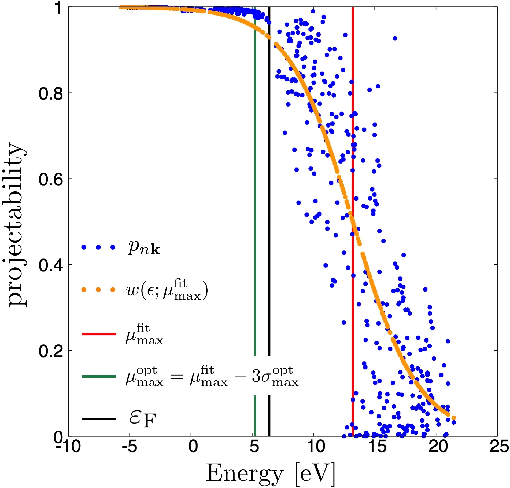
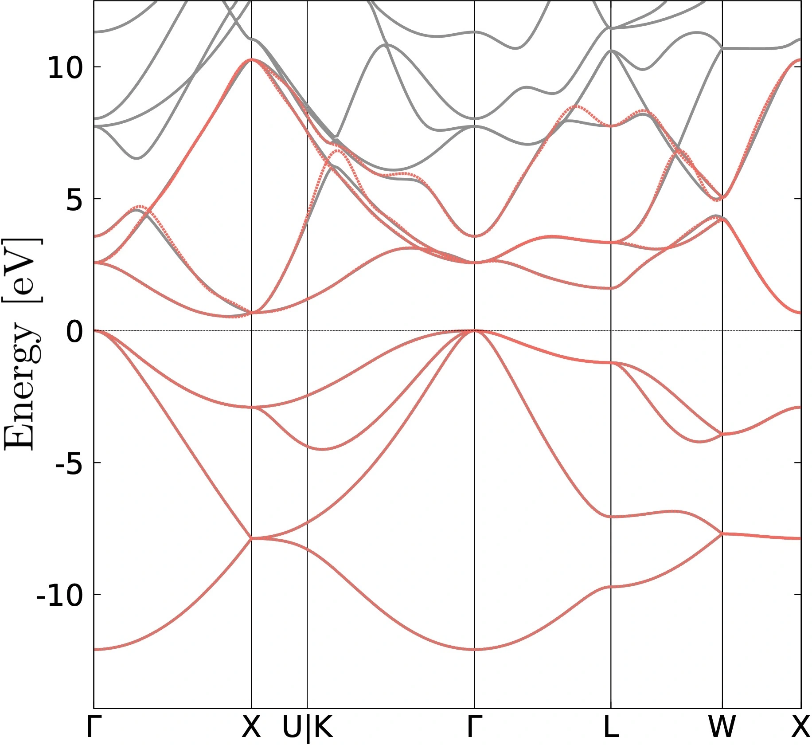

# 39: Silicon &#151; CWFs parameters from projectability

- Outline: Compute the closest Wannier functions (CWFs) and
    the Wannier interpolated band structure of
    bulk crystalline silicon based on the closest Wannier method
    using pseudo-atomic orbitals (PAOs) in pseudopotential file.
    Similar to the SCDM method (see Tutorial [27](tutorial_27.md)
    and Tutorial [32](tutorial_32.md) for more details),
    the free parameters in the closest Wannier method, i.e.,
    $\mu_{\rm min}$, $\mu_{\rm max}$, $\sigma_{\rm min}$, $\sigma_{\rm max}$,
    are determined automatically by fitting a window function to the projectabilities (See Ref. [@Vitale2019automated]).
    The number of CWFs is given by the number of PAOs in the
    pseudopotential, $8$ in this case.

- Directory: `tutorials/tutorial39/` *Files can be downloaded from
    [here](https://github.com/wannier-developers/wannier90/tree/develop/tutorials/tutorial39)*

- Input files

    - `silicon.scf` *The `pw.x` input file for ground state calculation*

    - `silicon.bands` *The `pw.x` input file for band structure calculation*

    - `silicon.bandsx` *The `bands.x` input file for extracting band structure eigenvalues*

    - `silicon.nscf` *The `pw.x` input file to obtain Bloch states on a uniform grid*

    - `silicon.pw2wan` *The input file for `pw2wannier90.x`*

    - `silicon.win` *The input file for `wannier90.x`*

    - `plot_band.gnu` *The gnuplot script to compare DFT and Wannier bands*

&nbsp;

1. Run `pw.x` to obtain the ground state of silicon

    ```bash title="Terminal"
    pw.x < silicon.scf > scf.out
    ```

2. Run `pw.x` to obtain the band structure of silicon

    ```bash title="Terminal"
    pw.x < silicon.bands > bands.out
    ```

3. Run `bands.x` to obtain a `silicon.band.gnu` file containing the band
    structure of silicon

    ```bash title="Terminal"
    bands.x < silicon.bandsx > bandsx.out
    ```

4. Run `pw.x` to obtain the Bloch states on a uniform k-point grid

    ```bash title="Terminal"
    pw.x < silicon.nscf > nscf.out
    ```

5. Run `wannier90.x` to generate a list of the required overlaps (written into the
    `silicon.nnkp` file).

    ```bash title="Terminal"
    wannier90.x -pp silicon
    ```

6. In order to use the PAOs in the pseudopotential file for the projections,
   one need to specify `atom_proj = .true.` in the input file for `pw2wannier90.x`.

    ```vi title="Input file"
    &INPUTPP
        outdir     =  './out/'
        prefix     =  'silicon'
        seedname   =  'silicon'
        write_amn  = .true.
        write_mmn  = .true.
        !write_unk  = .true.
        atom_proj = .true.
    /
    ```

7. Run `pw2wannier90.x` to compute the overlap between Bloch states and
    the projections for the starting guess (written in the `silicon.mmn`
    and `silicon.amn` files).

    ```bash title="Terminal"
    pw2wannier90.x < silicon.pw2wan > pw2wan.out
    ```

8. Fit the projectabilities with the window function
    $$
    \begin{align}
    & w(\varepsilon;\mu_{\rm max}, \mu_{\rm min}, \sigma_{\rm max}, \sigma_{\rm min})
    = \frac{1}{e^{(\varepsilon - \mu_{\rm max})/\sigma_{\rm max}} + 1}
    - \frac{1}{e^{(\mu_{\rm min} - \varepsilon)/\sigma_{\rm min}} + 1}
    - 1 + \delta, \qquad (\delta = 10^{-12}).
    \end{align}
    $$
    The projectability of each Bloch state $\psi_{n{\bf k}}$ onto
    the PAOs in the pseudopotential $\{\phi_{m}\}$ is defined by
    (See Eq. (22) in Ref. [@Vitale2019automated])
    $$
    \begin{equation}
    p_{n\bf{k}} = \sum_{m} |\langle \psi_{n{\bf k}}|\phi_{m {\bf k}}\rangle|^{2}.
    \end{equation}
    $$

    Run `fit_cwf_parameters.py` script to obtain the optimal free parameters,
    $\mu_{\rm max}^{\rm opt}
    = \mu_{\rm max}^{\rm fit} - 3 \sigma_{\rm max}^{\rm opt}$,
    $\mu_{\rm min}^{\rm opt}$, $\sigma_{\rm max}^{\rm opt}$,
    and $\sigma_{\rm min}^{\rm opt}$
    (See Ref. [@Vitale2019automated])

    ```bash title="Terminal"
    ../../utility/fit_cwf_parameters.py silicon
    ```

    The optimal free parameters are written in `cwf_parameters.dat` file as

    ```bash title="Terminal"
    # Optimized parameters:
    cwf_mu_max       = 5.235886133629259
    cwf_mu_min       = -5.699240901935335
    cwf_sigma_max    = 2.6573416617400367
    cwf_sigma_min    = 2.4638829865253342e-08
    ```

    In addition, the projectabilities and the fitting window function
    are written in `p_w_vs_e.dat` file.
    You should now see the projectabilities and the fitting function
    in the graph [Silicon Fit](#fig:silicon_fit).

    <figure markdown="span" id="fig:silicon_fit">
    { width="500"}
    <figcaption> Each blue dot represents the projectability as defined
    in Eq. (2) (See Eq. (22) in Ref. [@Vitale2019automated]).
    The yellow dotted line shows the fitted window function.
    The vertical red line represents the value of
    $\mu_{\rm max}^{\rm fit}$ while the vertical green
    line represents the optimal value of $\mu_{\rm max}^{\rm opt}$,
    i.e. $\mu_{\rm max}^{\rm opt}
    = \mu_{\rm max}^{\rm fit} - 3 \sigma_{\rm max}^{\rm opt}$.
    The vertical black line represents the Fermi energy.
    </figcaption>
    </figure>

9. Open `silicon.win` and modify the following lines

    ```vi title="Input file"
    cwf_mu_max    = 10    => 5.235886133629259
    cwf_mu_min    = -15   => -5.699240901935335
    cwf_sigma_max = 2.0   => 2.6573416617400367
    cwf_sigma_min = 0.0   => 2.4638829865253342e-08
    ```

10. Run `wannier90.x` to compute the CWFs.

    ```bash title="Terminal"
    wannier90.x silicon
    ```

    Inspect the output file `silicon.wout`.
    The CWFs are obtained without any iterative calculations,
    significantly reducing the computational costs.
    In addition, the band interpolation quality of the closest Wannier method
    is better than that of the MLWFs method.
    On the other hand, the spreads of the CWFs are larger than the MLWFs.

11. Run `gnuplot` to compare DFT and Wannier-interpolated bands, this
    will generate a PDF file `silicon_band.pdf`, see
    Fig.[Bands comparison](#fig:silicon_band_pao).

    ```bash title="Terminal"
    ./plot_bands.gnu
    ```

    <figure markdown="span" id="fig:silicon_band_pao">
    {width="500"}
    <figcaption> Comparison of band dispersions obtained from
    DFT calculations (grey solid lines) and Wannier interpolation using
    closest Wannier method (red dashed lines).
    </figcaption>
    </figure>

12. (Optional) Clean up all output files

    ```bash title="Terminal"
    make clean
    ```

## Further ideas

- To plot the CWFs, uncomment the following lines in
    `silicon.pw2wan`

    ```vi title="Input file"
    !write_unk = .true.
    ```

    and `silicon.win`

    ```vi title="Input file"
    !wannier_plot = .true.
    !wannier_plot_supercell = 3
    ```
